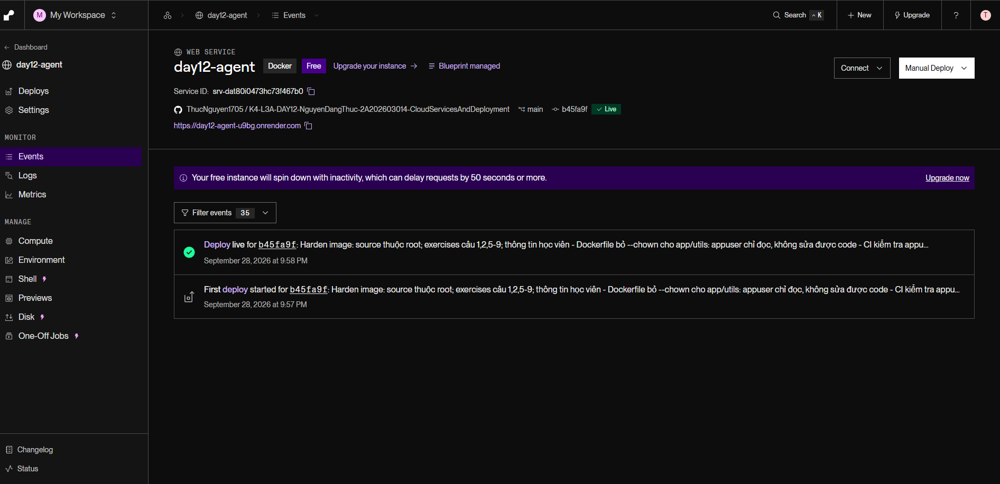
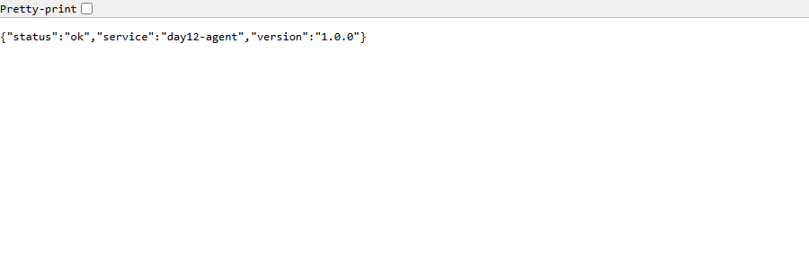

# Thông Tin Deploy — Checkpoint 5

> Điền file này sau khi deploy xong. `pytest tests/test_cp5.py` đọc file này
> để tìm địa chỉ service của bạn và gọi thử.
>
> **Chỉ ghi TÊN biến môi trường, tuyệt đối không dán giá trị API key vào đây.**
> Repo này công khai — dán khóa vào là mất khóa.

## Thông Tin Học Viên

| Mục | Nội dung |
|-----|----------|
| Họ và tên | Nguyễn Đăng Thực |
| Mã học viên | 2A202603014 |
| Repo | https://github.com/ThucNguyen1705/K4-L3A-DAY12-NguyenDangThuc-2A202603014-CloudServicesAndDeployment |

## Service

| Mục | Nội dung |
|-----|----------|
| Public URL | https://day12-agent-u9bg.onrender.com |
| Platform | Render — Blueprint từ `render.yaml`, web service Docker (free), region Singapore |
| Ngày deploy | 2026-09-28 |

## Biến Môi Trường Đã Set Trên Cloud

Ghi tên biến và **nguồn giá trị**, không ghi giá trị:

| Biến | Đã set | Ghi chú |
|------|--------|---------|
| `PORT` | ✅ | platform tự gán |
| `AGENT_API_KEY` | ✅ | đặt trong dashboard Render (`sync: false`), không nằm trong repo |
| `REDIS_URL` | ✅ | Render Key Value `day12-redis` (free, cùng region) — `fromService … connectionString` trong `render.yaml`, chỉ nối qua mạng nội bộ |
| `RATE_LIMIT_PER_MINUTE` | ✅ | 10 |
| `MONTHLY_BUDGET_USD` | ✅ | 10.0 |
| `LOG_LEVEL` | ✅ | INFO |

## Lệnh Kiểm Tra

Thay `<URL>` bằng Public URL ở trên:

```bash
# 1. Liveness — mong đợi 200 {"status":"ok"}
curl -i <URL>/health

# 2. Readiness — mong đợi 200 {"status":"ready"} (đã nối được Redis)
curl -i <URL>/ready

# 3. Không có API key — mong đợi 401
curl -i -X POST <URL>/ask \
  -H "Content-Type: application/json" \
  -d '{"question":"Hello"}'

# 4. Có API key — mong đợi 200 kèm câu trả lời
curl -i -X POST <URL>/ask \
  -H "Content-Type: application/json" \
  -H "X-API-Key: $AGENT_API_KEY" \
  -H "X-User-Id: sv-test" \
  -d '{"question":"Deploy là gì?"}'

# 5. Rate limit — gọi 15 lần, những lần cuối phải trả 429
for i in $(seq 1 15); do
  curl -s -o /dev/null -w "%{http_code} " -X POST <URL>/ask \
    -H "Content-Type: application/json" \
    -H "X-API-Key: $AGENT_API_KEY" \
    -H "X-User-Id: sv-test" \
    -d '{"question":"test"}'
done; echo
```

## Kết Quả Chạy Thật

Chạy lúc 2026-09-28T15:48:54Z (UTC) từ máy tôi vào bản deploy trên Render
(chỉ giữ dòng trạng thái, `Content-Type` và body; `$AGENT_API_KEY` đọc từ
`.env`, không in ra):

```
$ curl -i https://day12-agent-u9bg.onrender.com/health
HTTP/1.1 200 OK
Content-Type: application/json
{"status":"ok","service":"day12-agent","version":"1.0.0"}

$ curl -i https://day12-agent-u9bg.onrender.com/ready
HTTP/1.1 200 OK
Content-Type: application/json
{"status":"ready","redis":true}

$ curl -i -X POST https://day12-agent-u9bg.onrender.com/ask -H "Content-Type: application/json" -d '{"question":"Hello"}'
HTTP/1.1 401 Unauthorized
Content-Type: application/json
{"detail":"invalid or missing API key"}

$ curl -i -X POST https://day12-agent-u9bg.onrender.com/ask -H "Content-Type: application/json" \
    -H "X-API-Key: $AGENT_API_KEY" -H "X-User-Id: sv-deploy" --data-binary @body.json   # body.json = {"question":"Deploy là gì?"}
HTTP/1.1 200 OK
Content-Type: application/json
{"answer":"Câu hỏi hay. Deploy là gì thường được giải quyết bằng cách chuẩn hóa môi trường chạy: cùng một image chạy giống nhau ở laptop và trên cloud.","user_id":"sv-deploy","history_length":0,"cost_usd":2.145e-05,"tokens":{"in":3,"out":35}}

$ for i in $(seq 1 15); do curl -s -o /dev/null -w "%{http_code} " ... /ask (X-User-Id: sv-test); done
200 200 200 200 200 200 200 200 200 200 429 429 429 429 429
```

Ghi chú: lần đầu tôi chạy lệnh 4 đúng như mẫu (`-d '{"question":"Deploy là gì?"}'`)
trong Git Bash trên Windows và nhận `400 {"detail":"There was an error parsing the body"}`.
Lỗi nằm ở phía client: tham số dòng lệnh trên Windows không giữ được UTF-8 nên
chữ "là gì" tới server thành byte sai và JSON không hợp lệ. Gửi body từ file
UTF-8 (`--data-binary @body.json`) thì trả 200. Tôi đổi sang `X-User-Id: sv-deploy`
vì `sv-test` vừa dùng hết 10 request/phút ở lệnh 5.

**CI/CD:** mỗi lần push lên `main`, GitHub Actions chạy test → build image →
integration, rồi mới gọi Render Deploy Hook và smoke test lại `/health`,
`/ready`, `/ask` (401). Lần chạy xanh đầu tiên đi hết cả 4 job:
[run 36445911207](https://github.com/ThucNguyen1705/K4-L3A-DAY12-NguyenDangThuc-2A202603014-CloudServicesAndDeployment/actions/runs/36445911207).

## Ảnh Chụp Màn Hình

- `screenshots/dashboard.png` — service `day12-agent` trên Render: Docker,
  Blueprint managed, commit `b45fa9f` trạng thái **Live**, sự kiện "Deploy live"

  

- `screenshots/health.png` — `/health` của bản deploy mở bằng trình duyệt (Edge)

  

---

## Phương Án Dự Phòng

Không dùng — service chạy thật trên Render (`LOCAL_FALLBACK=false`).
